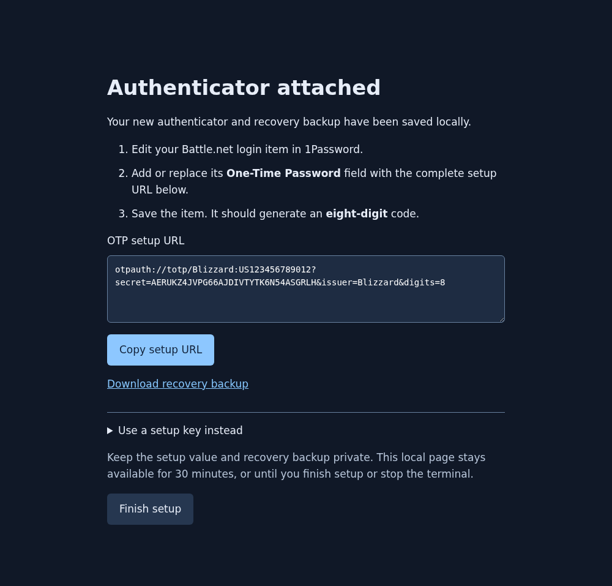

# Battle.net OTP

Set up a Battle.net authenticator for **1Password or another compatible OTP provider**. Sign in, attach, and copy your OTP setup value through a local web UI.



*Screenshot uses synthetic test data.*

## Install

Install [Node.js 22 or newer](https://nodejs.org/), then download and extract the repository using **Code → Download ZIP**, or clone it:

```sh
git clone https://github.com/MattieTK/battlenet-otp.git
cd battlenet-otp
```

Open a terminal in that folder. No dependencies or build step are required.

## Walkthrough

1. **Start setup.** Run:

   ```sh
   node bin/bna.js enroll
   ```

   Setup opens in your browser. Keep the terminal running. This flow attaches a **new authenticator** to your account.

2. **Sign in to Battle.net.** Use the sign-in button. Your browser returns to **Sign-in received** on the local page. If it sends you to account management instead, return to setup and use **Didn't return here? → Sign out … and try again**. That section also offers manual sign-in if needed.

3. **Complete attachment.** Select **Continue and attach authenticator**. The page shows the result when setup finishes. Download the recovery backup and keep it private and safe.

4. **Add it to 1Password.** Select **Copy setup URL**. Edit your Battle.net login in 1Password, add or replace its **One-Time Password** field, and paste the complete URL. Save the item, then select **Finish setup** in the browser. The URL includes the required **eight-digit** setting; treat it like a password.

5. **Verify.** Compare the code in 1Password with:

   ```sh
   node bin/bna.js show
   ```

   Compare within the same 30-second interval, then test a Battle.net sign-in. Other providers must support **TOTP, SHA-1, eight digits, and a 30-second period**.

To view a saved setup URL again, run `node bin/bna.js show-url`.

For WoW's extra backpack slots, [Blizzard also requires Battle.net Phone Notifications](https://worldofwarcraft.blizzard.com/en-us/news/23964689).

---

Independent project using a community-documented enrollment API. [Test results and limitations](TESTING.md) · [Read the code](ARCHITECTURE.md) · [Report a problem](https://github.com/MattieTK/battlenet-otp/issues)

Based on [python-bna](https://github.com/jleclanche/python-bna). [MIT license](LICENSE).
